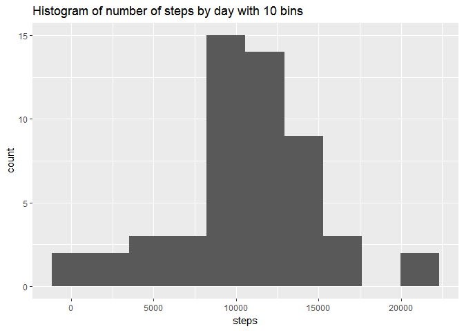
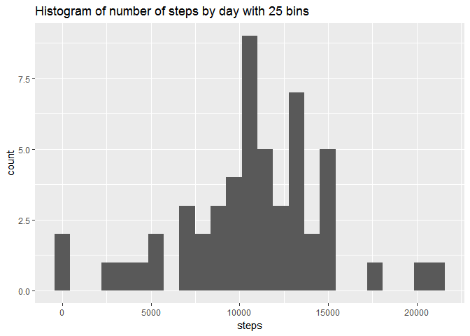
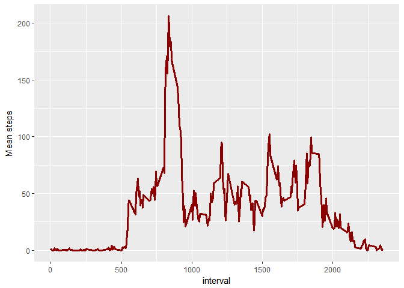
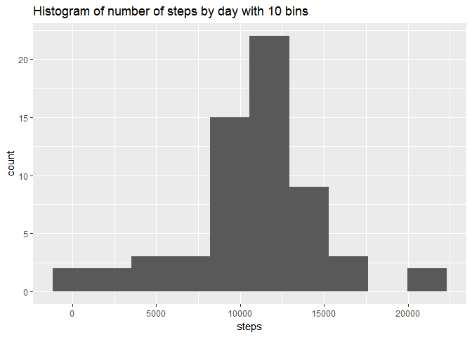
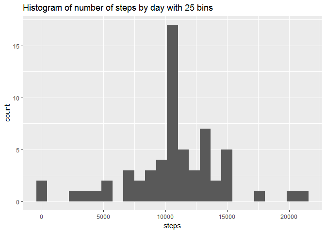
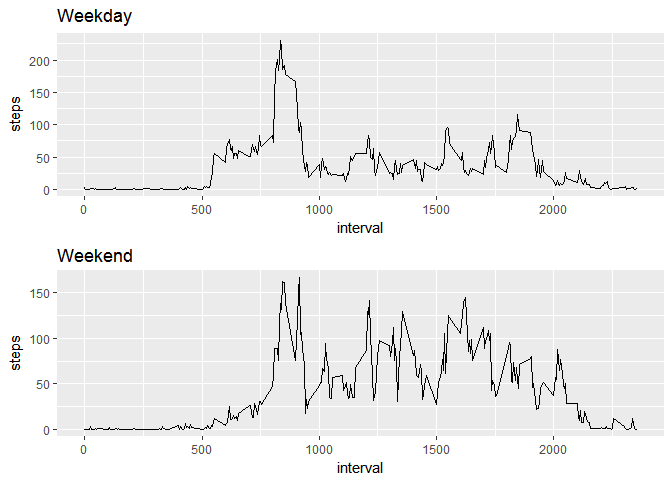

# dsa_rr_wk_2_project
Ray Miller  
November 28, 2017  


## Load and glimpse the data


```r
thedata <- read.csv("activity.csv")
glimpse(thedata)
```

```
## Observations: 17,568
## Variables: 3
## $ steps    <int> NA, NA, NA, NA, NA, NA, NA, NA, NA, NA, NA, NA, NA, N...
## $ date     <fctr> 2012-10-01, 2012-10-01, 2012-10-01, 2012-10-01, 2012...
## $ interval <int> 0, 5, 10, 15, 20, 25, 30, 35, 40, 45, 50, 55, 100, 10...
```

## Get rid of missing values, aggregate by day and calculate metrics

```r
cleandata <- thedata %>% 
    filter(!is.na(steps))

dailydata <- cleandata %>% 
    group_by(date) %>% 
    summarise(steps = sum(steps))

sum(cleandata$steps)
```

```
## [1] 570608
```

```r
mean(dailydata$steps)
```

```
## [1] 10766.19
```

```r
median(dailydata$steps)
```

```
## [1] 10765
```

```r
ggplot(data = dailydata) + geom_histogram(aes(steps), bins = 10) + ggtitle("Histogram of number of steps by day with 10 bins")
```

<!-- -->

```r
ggplot(data = dailydata) + geom_histogram(aes(steps), bins = 25) + ggtitle("Histogram of number of steps by day with 25 bins")
```

<!-- -->

### What is mean total number of steps taken per day?  
1. Total number of steps taken: 570608  
2. See the histograms above with 10 and 25 bins. While the concentration changes visually depending on how many bins are used, the highest counts are seen between 10k and 15k steps.  
3. Mean steps per day = 10766.19; Median steps taken per day = 10765  

## Aggregate by interval  

```r
intervaldata <- cleandata %>% 
    group_by(interval) %>% 
    summarise(steps = mean(steps))

ggplot(data = intervaldata) + geom_line(aes(x = interval, y = steps), lwd = 1.25, col = "dark red") + ylab("Mean steps")
```

<!-- -->

```r
max(intervaldata$steps)
```

```
## [1] 206.1698
```

```r
intervaldata$interval[intervaldata$steps == max(intervaldata$steps)]
```

```
## [1] 835
```

### What is the average daily activity pattern?
1. See above  
2. 8:35-8:40

## Imputed data

```r
# Number of values with NAs: 2304
nrow(thedata) - nrow(cleandata)
```

```
## [1] 2304
```

```r
# Use the mean for that interval to impute the values
imputeddata <- thedata

for(n in 1:nrow(imputeddata)) {
    
    if(is.na(imputeddata[n, ]$steps)) {
        imputeddata$steps[n] <- as.numeric(subset(intervaldata, interval == imputeddata$interval[n], select = steps))
    }    
}
imputeddata$steps <- as.numeric(imputeddata$steps)


# Imputed data histogram, mean, and median
dailydata2 <- imputeddata %>% 
    group_by(date) %>% 
    summarise(steps = sum(steps))

# Mean = same, median slightly changes, some changes seen in histogram
mean(dailydata2$steps)
```

```
## [1] 10766.19
```

```r
median(dailydata2$steps)
```

```
## [1] 10766.19
```

```r
# Histograms with diff numbers of breaks (10 looks best and most days have 10-15k steps)
ggplot(data = dailydata2) + geom_histogram(aes(steps), bins = 10)  + ggtitle("Histogram of number of steps by day with 10 bins")
```

<!-- -->

```r
ggplot(data = dailydata2) + geom_histogram(aes(steps), bins = 25)  + ggtitle("Histogram of number of steps by day with 25 bins")
```

<!-- -->

### Imputing missing values
1. There are 2304 rows with missing values
2. As shown in the code above, I imputed the missing step values using the mean step values for each five minute interval.  
3. The imputeddata dataset has the missing values filled in.
4. See the histograms above. The mean didn't change since we added values according to the mean already present. However, the median did change slightly.

## Weekdays vs weekends

```r
# Weekdays vs weekends
imputeddata$dow <- weekdays(as.Date(imputeddata$date))
glimpse(imputeddata)
```

```
## Observations: 17,568
## Variables: 4
## $ steps    <dbl> 1.7169811, 0.3396226, 0.1320755, 0.1509434, 0.0754717...
## $ date     <fctr> 2012-10-01, 2012-10-01, 2012-10-01, 2012-10-01, 2012...
## $ interval <int> 0, 5, 10, 15, 20, 25, 30, 35, 40, 45, 50, 55, 100, 10...
## $ dow      <chr> "Monday", "Monday", "Monday", "Monday", "Monday", "Mo...
```

```r
# Iterate as before
for(n in 1:nrow(imputeddata)) {
    
    if(imputeddata$dow[n] == "Saturday") {
        imputeddata$type[n] <- "Weekend"
    } else if(imputeddata$dow[n] == "Sunday") {
        imputeddata$type[n] <- "Weekend"
    } else {
        imputeddata$type[n] <- "Weekday"
    }
}

plot1 <- imputeddata %>% 
    filter(type == "Weekday") %>% 
    group_by(interval) %>% 
    summarise(steps = mean(steps)) %>% 
    ggplot() + geom_line(aes(x = interval, y = steps)) + ggtitle("Weekday")

plot2 <- imputeddata %>% 
    filter(type == "Weekend") %>% 
    group_by(interval) %>% 
    summarise(steps = mean(steps)) %>% 
    ggplot() + geom_line(aes(x = interval, y = steps)) + ggtitle("Weekend")
    
grid.arrange(plot1, plot2, nrow=2, ncol=1)
```

<!-- -->

### Are there differences in activity patterns between weekdays and weekends?
1. The variable "type" in imputeddata indicates whether the day is on a weekday or the weekend.
2. See the combined plot above.

